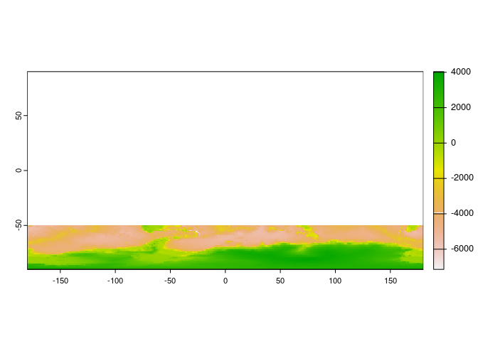
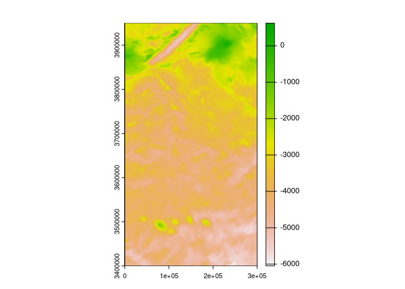
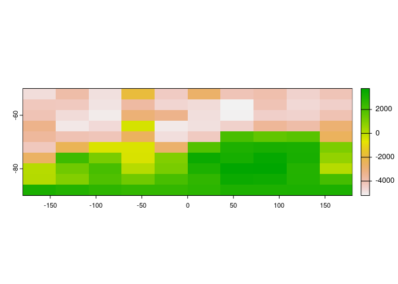
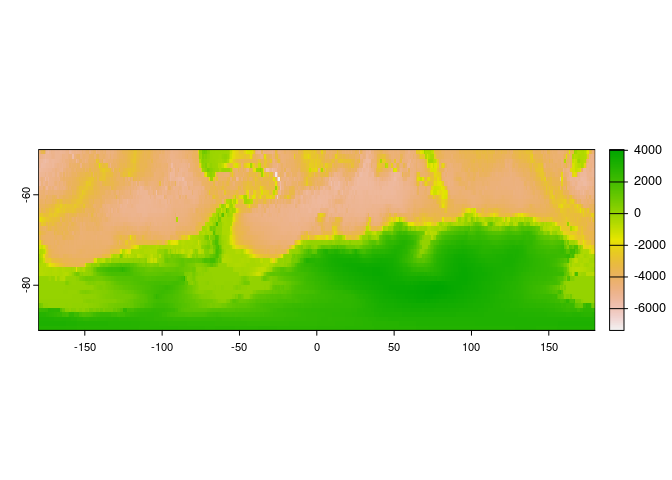
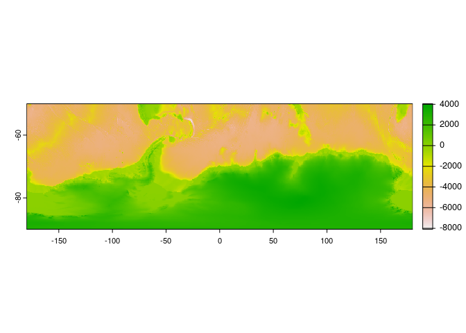
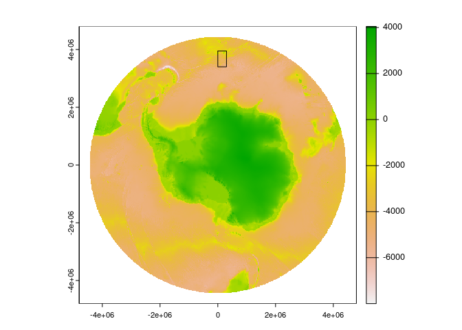

<!-- README.md is generated from README.Rmd. Please edit that file -->

## IBCSO

International Bathymetric Chart of the Southern Ocean (IBCSO) is the
authoritative map of the Southern Ocean, providing a raster bathymetric
chart of depths, currently at v2 in 2023.

The .tif format is slow, it is not a Cloud-Optimized GeoTIFF so we would
like to demonstrate the benefits of that format.

We download it and convert to Cloud Optimized GeoTIFF and then host it
at this url
<https://github.com/mdsumner/ibcso-cog/raw/main/IBCSO_v2_ice-surface_cog.tif>.

    wget https://download.pangaea.de/dataset/937574/files/IBCSO_v2_ice-surface.tif

    gdal_translate IBCSO_v2_ice-surface.tif IBCSO_v2_ice-surface_cog.tif -of COG -co COMPRESS=ZSTD -co PREDICTOR=2 -co SPARSE_OK=YES -co OVERVIEW_RESAMPLING=AVERAGE -co BLOCKSIZE=480 -co NUM_THREADS=ALL_CPUS

See below for notes on these options.

Some comparisons on performance are shown below, please note that five
quite different extractions from the COG url are timed for less than 10
seconds, giving five quite different data configurations at different
scales and in different projections. To do one of the five from the
local copy of the current v2 .tif takes nearly 10 seconds on its own.

``` r
dsn <- "/vsicurl/https://github.com/mdsumner/ibcso-cog/raw/main/IBCSO_v2_ice-surface_cog.tif"
library(terra)
```

    ## terra 1.7.46

``` r
r <- rast(dsn)


system.time({
r1 <- project(r, rast(), by_util = T)
template <- rast(r)
res(template) <- res(r) * 20


## this extent is one small part at the original resolution
(r2 <- project(r, rast(ext(c(0, 3e+05, 3400000, 3950000)), crs = crs(r), res = 500), by_util = TRUE))

## these work very quickly
r3 <- project(r, rast(ext(-180, 180, -90, -50)), by_util = T)
r4 <- project(r, rast(ext(-180, 180, -90, -50), res = 1), by_util = T)
r5 <- project(r, rast(ext(-180, 180, -90, -50), res = .25), by_util = T)

})
```

    ##    user  system elapsed 
    ##   0.604   0.101  13.075

``` r
## even if we use the local .tif, with the older format it's much slower
rlocal <- rast("IBCSO_v2_ice-surface.tif")

system.time(project(rlocal, template, by_util = T))
```

    ##    user  system elapsed 
    ##   6.720   2.960   9.681

Plot the different extractions to show that they worked.

``` r
plot(r1)
```

<!-- -->

``` r
plot(r2)
```

<!-- -->

``` r
plot(r3)
```

<!-- -->

``` r
plot(r4)
```

<!-- -->

``` r
plot(r5)
```

<!-- -->

``` r
plot(project(r, template, by_util = TRUE))
plot(ext(r2), add = TRUE)
```

<!-- -->

In Python it’s similar, we can do

``` python
from osgeo import gdal
ds = gdal.Open("/vsicurl/https://github.com/mdsumner/ibcso-cog/raw/main/IBCSO_v2_ice-surface_cog.tif")

w = gdal.Warp("/vsimem/myfile.vrt", ds, xRes = 10000, yRes = 10000)
w.GetGeoTransform()
# (-4800000.0, 10000.0, 0.0, 4800000.0, 0.0, -10000.0)

w.ReadAsArray()
#array([[-32768, -32768, -32768, ..., -32768, -32768, -32768],
#       [-32768, -32768, -32768, ..., -32768, -32768, -32768],
#       [-32768, -32768, -32768, ..., -32768, -32768, -32768],
#       ...,
#       [-32768, -32768, -32768, ..., -32768, -32768, -32768],
#       [-32768, -32768, -32768, ..., -32768, -32768, -32768],
#       [-32768, -32768, -32768, ..., -32768, -32768, -32768]], dtype=int16)

```

## gdal translate options

We chose options blocksize 480 so that the smallest overview would be
that size (at 4800 we only end up with 2 overview levels).

SPARSE_OK: ensures unused blocks are not stored (they are all 0, or
nodata).

COMPRESS: could choose DEFLATE instead

OVERVIEW_RESAMPLING: AVERAGE so that the average value is stored from
higher resolution levels, not just a sample

NUM_THREADS: this just makes it go faster (for the compression).
